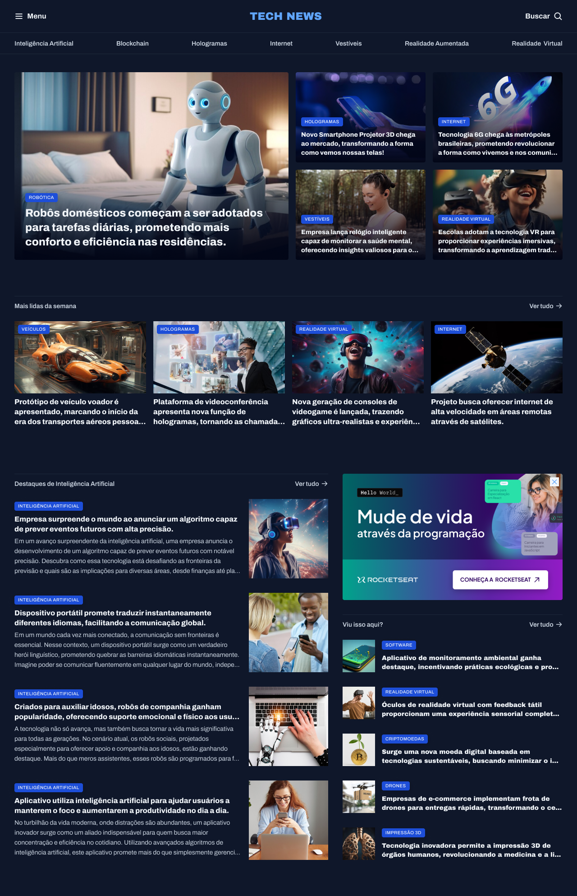

# TechNews | Portal de Notícias de Tecnologia 💻📱

O TechNews é um portal de notícias focado em tecnologia, onde os usuários podem encontrar artigos sobre as últimas tendências, inovações e eventos do mundo tech. Este projeto foi desenvolvido utilizando apenas HTML e CSS avançado, mostrando como é possível criar uma experiência de leitura envolvente e bem estruturada sem JavaScript.

## 🌅 Visão Geral do Projeto
O TechNews foi projetado para servir como uma plataforma de notícias, oferecendo um layout organizado e agradável para a leitura de artigos. Este projeto explora técnicas avançadas de CSS, como flexbox, grid, animações, efeitos de hover e tipografia moderna, proporcionando um visual profissional e fácil de navegar.
## 🎨 Tecnologias Utilizadas
* HTML5: Estruturação do conteúdo, organização das seções e dos artigos.
* CSS3 Avançado: Usando flexbox, grid, pseudo-elementos e transições para estilizar o layout e os efeitos visuais.
## 🚀 Funcionalidades
* Listagem de Artigos: Exibe notícias em um layout de grade ou lista, facilitando a navegação pelos tópicos de interesse.
* Destaques de Notícias: Inclui uma seção de notícias principais, com títulos maiores e imagens em destaque.
* Efeitos de Hover: Animações e transições ao passar o mouse sobre as notícias, aumentando a interatividade.
* Design Responsivo: Layout otimizado para dispositivos móveis e desktops, garantindo uma experiência fluida em qualquer tamanho de tela.
## 📋 Pré-requisitos
Não há requisitos adicionais para rodar este projeto. Basta abrir o arquivo HTML em qualquer navegador.
## 📄 Estrutura do Projeto
* `index.html`:  Contém a estrutura HTML principal do portal, incluindo a listagem de notícias e a seção de destaques.
* `style.css`:  Arquivo de estilos CSS onde são definidos o layout e os efeitos visuais avançados.
* `assets/`: Pasta para armazenar as imagens das notícias e ícones de navegação.
## 🖥️ Como Usar
1. Clone este repositório para a sua máquina:
~~~bash
https://github.com/rafSnow/Portal-de-noticias.git
~~~
2. Abra o arquivo index.html no seu navegador.
## 📸 Visualização do Projeto

## 💡 Técnicas de CSS Avançado
Este projeto faz uso das seguintes técnicas avançadas de CSS:

* CSS Grid: Organiza o layout principal, especialmente na exibição das notícias em grid.
* Flexbox: Distribui o layout de cabeçalho e rodapé, mantendo uma estrutura responsiva.
* Transições e Animações: Para efeitos ao passar o mouse sobre os artigos, tornando a navegação mais interativa.
* Pseudo-elementos: Usados para personalizações visuais, como separadores, sombreamento e sobreposições.
## 📝 Melhorias Futuras
* Adicionar uma seção de comentários em cada artigo para promover interações.
* Implementar um modo escuro apenas com CSS.
* Incluir uma barra de pesquisa para facilitar a busca por temas específicos
## 🧑‍💻 Autor 
Feito com 💖 por Rafael Neves.
